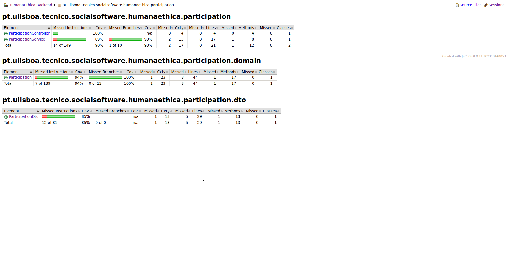

## Feature Participant Selection

### Subgroup
 - Miguel Barreto Gomes, ist1103559, [GitLab link](https://gitlab.rnl.tecnico.ulisboa.pt/ist1103559)
   + Issues assigned: [#42](https://gitlab.rnl.tecnico.ulisboa.pt/es/es24-19/-/issues/42), [#20](https://gitlab.rnl.tecnico.ulisboa.pt/es/es24-19/-/issues/20), [#21](https://gitlab.rnl.tecnico.ulisboa.pt/es/es24-19/-/issues/21), [#22](https://gitlab.rnl.tecnico.ulisboa.pt/es/es24-19/-/issues/22), [#43](https://gitlab.rnl.tecnico.ulisboa.pt/es/es24-19/-/issues/43), [#44](https://gitlab.rnl.tecnico.ulisboa.pt/es/es24-19/-/issues/44), [#45](https://gitlab.rnl.tecnico.ulisboa.pt/es/es24-19/-/issues/45), [#46](https://gitlab.rnl.tecnico.ulisboa.pt/es/es24-19/-/issues/46), [#47](https://gitlab.rnl.tecnico.ulisboa.pt/es/es24-19/-/issues/47), [#48](https://gitlab.rnl.tecnico.ulisboa.pt/es/es24-19/-/issues/48), [#50](https://gitlab.rnl.tecnico.ulisboa.pt/es/es24-19/-/issues/50), [#51](https://gitlab.rnl.tecnico.ulisboa.pt/es/es24-19/-/issues/51), [#55](https://gitlab.rnl.tecnico.ulisboa.pt/es/es24-19/-/issues/55), [#56](https://gitlab.rnl.tecnico.ulisboa.pt/es/es24-19/-/issues/56)
 - Pedro Vaz Pereira, ist198962 , [GitLab link](https://gitlab.rnl.tecnico.ulisboa.pt/ist198962)
   + Issues assigned: [#52](https://gitlab.rnl.tecnico.ulisboa.pt/es/es24-19/-/issues/52), [#24](https://gitlab.rnl.tecnico.ulisboa.pt/es/es24-19/-/issues/24), [#49](https://gitlab.rnl.tecnico.ulisboa.pt/es/es24-19/-/issues/49), [#53](https://gitlab.rnl.tecnico.ulisboa.pt/es/es24-19/-/issues/53), [#54](https://gitlab.rnl.tecnico.ulisboa.pt/es/es24-19/-/issues/54), [#57](https://gitlab.rnl.tecnico.ulisboa.pt/es/es24-19/-/issues/57), [#58](https://gitlab.rnl.tecnico.ulisboa.pt/es/es24-19/-/issues/58), [#23](https://gitlab.rnl.tecnico.ulisboa.pt/es/es24-19/-/issues/23), [#43](https://gitlab.rnl.tecnico.ulisboa.pt/es/es24-19/-/issues/43)
 
### Merge requests associated with this feature

The list of pull requests associated with this feature is:

 - [MR #1](https://gitlab.rnl.tecnico.ulisboa.pt/es)

### Test Coverage Screenshot

The screenshot includes the test coverage results associated with the new/changed entities:

### Feature Institution Assessment

### Subgroup

  - Tiago Migue Santos Dias, ist1102613, [GitLab link](https://gitlab.rnl.tecnico.ulisboa.pt/ist1102613)

    + Issues assigned: [#41](https://gitlab.rnl.tecnico.ulisboa.pt/es/es24-19/-/issues/41), [#37](https://gitlab.rnl.tecnico.ulisboa.pt/es/es24-19/-/issues/37), [#38](https://gitlab.rnl.tecnico.ulisboa.pt/es/es24-19/-/issues/38), [#17](https://gitlab.rnl.tecnico.ulisboa.pt/es/es24-19/-/issues/17), [#11](https://gitlab.rnl.tecnico.ulisboa.pt/es/es24-19/-/issues/11), [#18](https://gitlab.rnl.tecnico.ulisboa.pt/es/es24-19/-/issues/18), [#12](https://gitlab.rnl.tecnico.ulisboa.pt/es/es24-19/-/issues/12), [#19](https://gitlab.rnl.tecnico.ulisboa.pt/es/es24-19/-/issues/19), [#39](https://gitlab.rnl.tecnico.ulisboa.pt/es/es24-19/-/issues/39), [#40](https://gitlab.rnl.tecnico.ulisboa.pt/es/es24-19/-/issues/40)

  - Tiago Coutinho Carreto Tavares Rebelo, ist1103037, [GitLab link](https://gitlab.rnl.tecnico.ulisboa.pt/ist1103037)

      + Issues assigned:

### Merge requests associated with this feature

The list of pull requests associated with this feature is:

  - [MR #1](https://gitlab.rnl.tecnico.ulisboa.pt/es)

### Test Coverage Screenshot
The screenshot includes the test coverage results associated with the new/changed entities:

---
